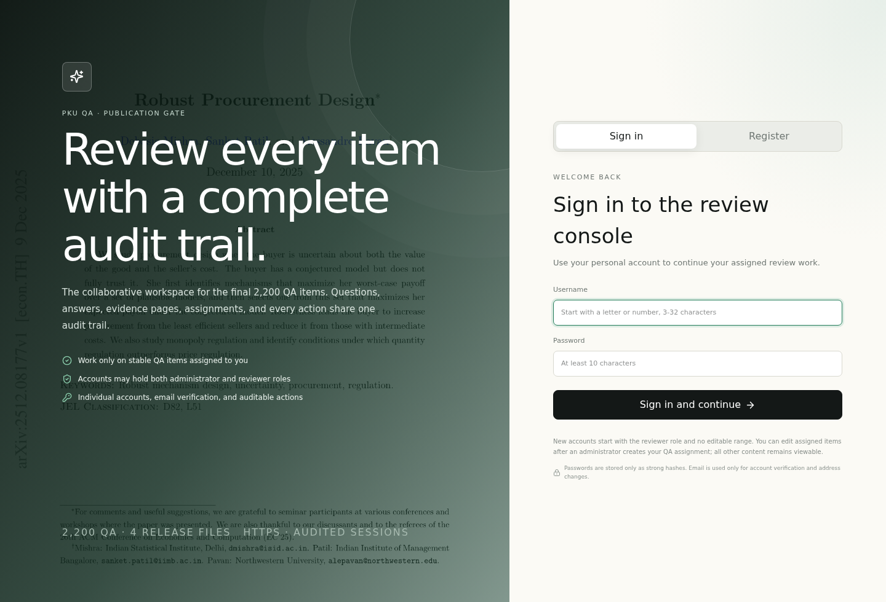
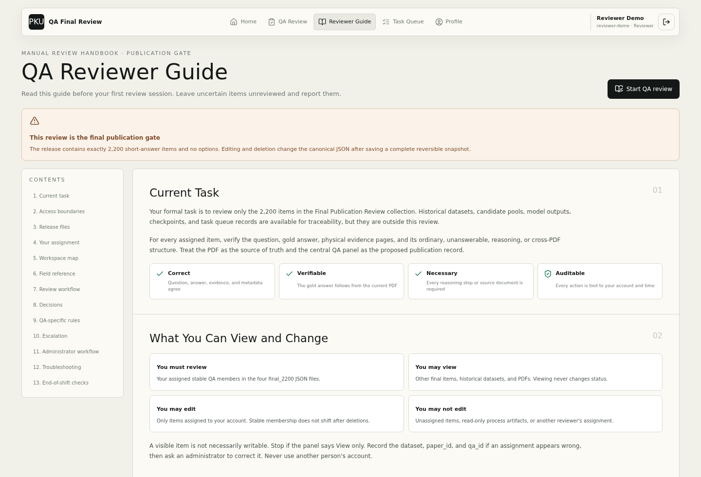
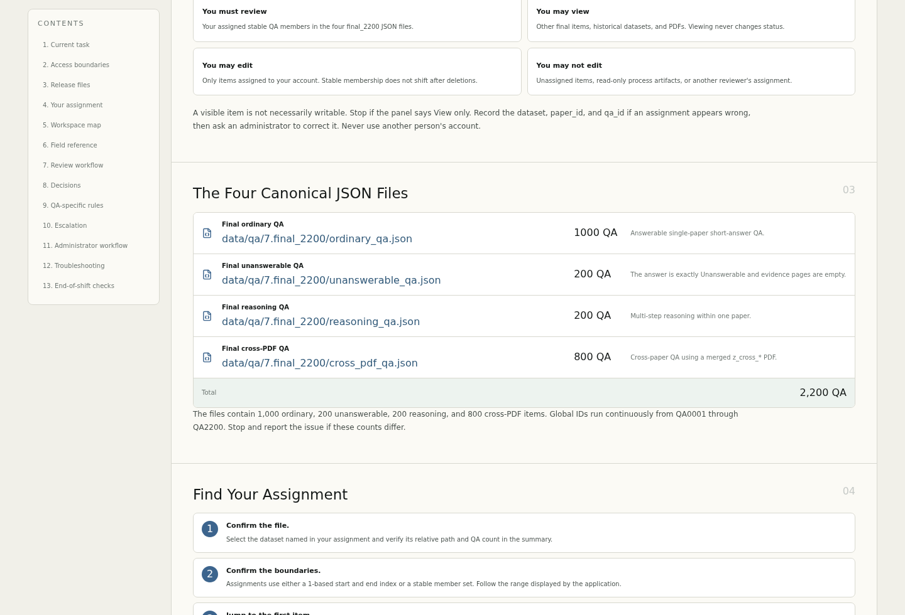

# 最终 2,200 条 QA 人工校验手册

当前评分命令见 [evaluation Quick Start](../../evaluation/README.md#quick-start)。
本手册审核的是当前四文件发布集；原实验回放使用结果文件中保存的历史参考标注，
不会自动吸收后来的人审修改。两者的版本应分别记录。

本手册对应网页 `/guide`。它是论文发表前最后一轮人工质量门禁，不是重新生成题目或
改写评测协议的步骤。

## 1. 任务目标

逐题检查：

1. `question` 是否完整、明确、不泄露答案。
2. `answer` 是否正确、直接且精度合适。
3. `evidence_pages` 是否为从 1 开始的 PDF 物理页，并能支持答案。
4. Reasoning 是否确有必要的多步推理。
5. Cross-PDF 是否确有必要的多文档依赖。
6. 其他答案格式、单位、来源映射和证据事实字段是否互相一致。

判断只能依据 QA 和 PDF。Claude/Gemini/Qwen 的历史正确率是选题背景，不是人工修改
金答案的依据。不可回答题只允许精确字符串 `Unanswerable`。

## 2. 最终文件

| JSON | QA | 内容 | PDF |
| --- | ---: | --- | --- |
| `data/qa/7.final_2200/ordinary_qa.json` | 1,000 | 普通可回答题 | `data/pdfs/` |
| `data/qa/7.final_2200/unanswerable_qa.json` | 200 | 精确拒答题 | `data/pdfs/` |
| `data/qa/7.final_2200/reasoning_qa.json` | 200 | 单论文多步推理题 | `data/pdfs/` |
| `data/qa/7.final_2200/cross_pdf_qa.json` | 800 | 跨论文推理题 | `data/pdfs/` |

四个文件共 2,200 条。网页将它们放在“发表前最终人工校验（2200 条）”集合，其余
基线、候选、历史 Reasoning 和辅助 JSON 放在“其他数据与历史版本”集合。最终四个
文件全部是简答题，manifest 标记 `qa_format: "short_answer_only"`；任何 QA 都不应包含
`options`，构建预检发现该字段会直接失败。历史原始/混合文件中的选择题只用于谱系追溯，
不得混入最终 2,200 条。

## 3. 账户规则

- 每位同学使用独立账户，不共享用户名或代替他人点击。
- 新同学可在登录页注册，填写真实姓名、username、至少 10 位密码和邮箱验证码；注册后默认
  只有校验员身份，尚未获得任何 QA 修改范围。
- 管理员可以分别添加或删除管理员、校验员身份；同一账户可同时拥有两种身份，至少保留一种，
  `czj-web` 的管理员身份不可删除。管理员兼任校验员后仍可管理账户、分配与队列，但逐题修改
  只允许发生在分给自己的 QA 范围内。
- 拥有管理员身份的用户在“人工校验分配”中选择校验员、JSON 文件和 1-based 起止 QA 序号。不同同学
  的范围不能重叠；需要跨文件时分别建立多条分配。
- 管理员可在“用户与操作审计 → 校验员进度监督”查看每位校验员的已完成/已分配、完成率、保留、
  修改、删除和最近操作时间；没有分配任务的人也会显示为 0，停用账户的历史进度不会消失。
- 分配创建时会固化到稳定的 paper_id/qa_id。即使前面的 QA 后来被删除，已分配题也不会
  因当前序号变化而转移到其他账户。
- 拥有校验员身份的用户可以查看全部 QA 和 PDF，但只能修改分配给自己的题；未分配题显示“仅可查看”，
  保留、删除和撤销请求会被后端以 403 拒绝。
- 密码只保存 scrypt 强哈希；管理员无法查看旧密码，只能重置。
- 停用账户会立即删除其全部会话。
- `czj-web` 是 bootstrap 管理员，使用应用账户密码登录；公网不再使用 perimeter 交换。
- 登录后可在“个人中心”修改真实姓名、用户名、验证邮箱和密码；换绑邮箱需要验证新邮箱。
- 离开公共电脑前使用右上角退出按钮。

## 4. 字段说明

### 论文/PDF 级

| 字段 | 含义与检查重点 |
| --- | --- |
| `paper` / 顶层 `paper_id` | 对应 PDF 文件名或 Cross-PDF bundle ID。网页当前 PDF 必须与之匹配。 |
| `QA` | `{qa_id: qa}` 映射。报告问题时提供 dataset、paper_id、qa_id 三元组。 |
| `primary_category`, `secondary_category` | 领域分类；明显与论文不符时记录问题。 |
| `pdf_metadata` | 页数和来源元数据；证据页不得超出实际物理页数。 |
| `source_documents` | 旧构建来源可含来源区间；最终四文件 paper 层没有此字段，不应假设它存在。 |
| `source_paper_ids` | 部分 Cross-PDF QA 层保留来源 ID，不是最终 paper 层共有字段。 |
| `pdf_page_numbering` | 应说明物理页口径。 |

### QA 级

| 字段 | 含义与检查重点 |
| --- | --- |
| `question` | 模型看到的问题；需完整、无歧义、无答案泄露。 |
| `answer` | 独立金答案；不可回答必须精确为 `Unanswerable`。 |
| `answer_format` | `Integer`、`Float`、`String`、`List` 或 `Unanswerable`，与答案实际类型一致。 |
| `answer_aliases` | 保留的历史标注元数据；公开 v4 评分将语义等价性全部交给 sxz 校准三分类 Judge。 |
| `answer_unit` | 数值答案单位；问题要求单位时必须正确。 |
| `numeric_tolerance` | absolute/relative 容差；只能在原始标注确有精度需要时存在。 |
| `string_metric` | 历史字段；最终四文件不存在，公开评测不使用字符串预匹配。 |
| `evidence_pages` | 从 1 开始的 PDF 文件物理页；不是论文页脚印刷页码。 |
| `evidence_items` | Cross-PDF 逐事实证据，含物理页、来源文档、来源页和 `supported_fact`。 |
| `evidence_source_docs` | 金证据覆盖的来源文档编号，应和 evidence items/source IDs 一致。 |
| `evidence_hops` | 必要证据或推理跳数；不能靠标签冒充真实多步依赖。 |
| `evidence_span` / `evidence_span_ratio` | 最远证据页跨度及其相对比例。 |
| `modal_types` | 实际所需模态数组，只使用并按 `text`、`image`、`table`、`formula` 固定顺序记录；跨 PDF 或跨证据页题必须合并所有必要模态。 |
| `question_type`, `question_category` | 作答或推理关系分类，应与题目逻辑相符。 |
| `annotation_provenance` | 生成、复审、修订与发布来源，用于追溯。 |
| `qa_uid` | 跨文件稳定唯一标识，不得因人工浏览随意重写。 |

网页当前数据集上方的字段字典会实时给出字段类型、出现次数和覆盖率。

对发表前 `final_2200` 集合，六个核心字段 `question`、`answer`、`evidence_pages`、
`modal_types`、`question_type`、`question_category` 在每道题中都必须存在；组件中的
`annotation_provenance`、Reasoning/Cross-PDF 关系、来源和审核字段属于可保留的专项审计
信息，不要因核心字段统一而删除。提交前可用
`PYTHONPATH=src python -m pku_qa.workflows.selection.normalize_final_2200_release --check-only`
检查整个集合。

## 5. 单题固定流程

把每一道 QA 当成一条必须闭环的流水线来做。一次只处理中央卡片显示的当前题，严格按
第一步、第二步、第三步、第四步顺序进行；不要因为题目看起来简单就跳过证据页，也不要
在还没有看完 PDF 时先点“保留”或“删除”。发现问题时先记下当前的
`dataset_id + paper_id + qa_id`，这样即使需要跳过，也能准确报告给负责人。每一步都要
达到本节列出的完成标志，才可以进入下一步。

### 第一步：读问题和答案

**开始条件：**先确认顶部显示的是自己正在处理的 JSON，中央显示了当前题号、
`paper_id` 和 `qa_id`。这一阶段只读问题和标准答案，不先查看模型历史回答，也不先
点击任何决定按钮。

**逐项操作：**

1. 从头到尾读完 `question`，确认它是完整的简答问题，而不是残句、选项填空或把答案
   写进问题的提示句。
2. 圈出问题中的对象、时间范围、数据集、比较双方、方向、单位和要求的输出形式。检查
   这些条件是否都已写出，是否存在“它/该方法/这个结果”等无法确定指代。
3. 再读 `answer`，逐句对照问题。答案必须直接回答所问对象，不能只给论文背景、相近
   方法名或另一道题的数字；数值要注意小数位、正负号、百分比与小数的区别，名称要
   注意缩写、大小写和相似实体。
4. 查看 `answer_format`、`answer_aliases`、`answer_unit` 和 `numeric_tolerance`，确认
   它们没有把答案类型、单位或精度写成另一种含义。最终集合是纯简答题，不应出现
   `options` 字段。

**结果分支：**如果只是措辞、单位、数值或条件可以从 PDF 唯一确定，标记为“待修改”，
不要直接删除；如果问题缺少关键条件、答案来自另一道题、存在两个合理答案，先标记为
“可能无法修复”，留到第四步决定。完全读懂且没有明显问题，才进入第二步。

**完成标志：**你可以不用回看原文，用一句话准确复述“这道题问什么”，并能指出答案中
每个关键实体、数值或结论需要在 PDF 中找到什么类型的支持。

### 第二步：逐个查看证据物理页

**开始条件：**读取“证据物理页”区域列出的全部页码，按页面方块从左到右逐个点击。
点击“第 N 页”后，右侧 PDF 会用 `#page=N` 跳转。这里的 N 是从 1 开始的 PDF 文件物理
页号，不是页脚或页眉印刷的论文页码。
网页会为每次点击重新定位内置 PDF 查看器，因此重复点击同一个页码也应回到该页；重新定位
仍会复用浏览器中同一 PDF 的私有缓存。如果右侧标题显示目标页但 PDF 内容没有跳转，先再次
点击该页，仍无效则按系统故障记录浏览器、时间和题目三元组，不要据此删除 QA。

**每一页的固定检查顺序：**

1. 先定位页面中的相关段落、表格、图片或公式，确认页码没有越界、错位或跳到另一篇
   论文。
2. 对文字逐项核对实体、方法、数据集、指标名、时间和结论方向。
3. 对数字核对原始数值、单位、显著性、上下界、比较对象和四舍五入；不要把百分比当成
   小数，也不要把下降幅度读成提升幅度。
4. 对表格核对标题、行名、列名、脚注和单位；对图核对图例、坐标轴、颜色、曲线和子图
   编号；对公式核对变量定义、约束、上下界以及推导方向。
5. 对每个证据页写出一句“第 N 页支持答案中的哪一句”。答案含多个独立事实时，必须能
   为每个事实找到对应页面；只讲背景、没有支撑作用的页应标记为冗余或错页。

**结果分支：**如果页码标错但正确页能唯一确定，第四步进入修改；如果页码越界、PDF 中
找不到必要事实、证据支持相反结论，且不能可靠确定替代页，第四步删除。仅在未标注的
相邻页出现相关内容，不能自动视为当前 `evidence_pages` 正确。

**完成标志：**每一个答案要点都有至少一个真实支持页，所有标注页都确实有用；你能够
解释“第 N 页为什么支持答案”，而不是只说“看起来相关”。

### 第三步：检查题型依赖

这一步不是重新给题目分类，而是确认当前题的证据数量和结构确实是必要的。先根据文件
名称和 `question_type` 判断所属分支，再完成对应检查：

- **普通可回答题：**证据页直接、唯一地支持答案，不需要用 PDF 外的常识补全。问比较时
  要同时看到双方和方向；问数值时要看到原始数值、计算关系和单位。
- **Unanswerable：**确认 PDF 真的缺少推出唯一答案的必要信息，而不是信息藏得深或暂时
  没找到。`answer` 必须精确为 `Unanswerable`，`answer_format` 也应为
  `Unanswerable`，`evidence_pages` 必须是 `[]`。
- **Reasoning：**按证据页列出“第一跳事实、第二跳事实……”和最终推导。逐个假设去掉
  一跳，检查是否仍能得到同一答案；若可以，说明该页不是必要依赖。若某页直接写出最终
  答案、第一跳只是“论文提出的方法叫什么”，则高难推理依赖不成立。
- **Cross-PDF：**按 `evidence_items.source_doc_number` 逐篇检查。至少两篇来源论文必须
  各贡献不可省略的事实，答案必须做真实关系推导；只读一篇即可回答，或只是并列抄写两
  篇结论，都不满足跨论文依赖。

**完成标志：**你能说清当前题属于哪个分支、需要哪些页或来源、去掉哪一页/哪一来源会
失去哪个必要事实，并确认没有把标签当成证据本身。

### 第四步：做决定

根据前三步的记录选择且只选择一个动作：

1. **全部通过：**问题、答案、证据页、字段和必要依赖都没有实质问题，点击“保留并下一条”。
   这只写入 `kept` 状态与审计，不会改写 QA 文本。
2. **可以挽救：**问题措辞、标准答案事实/数值/单位或证据页存在可明确修复的问题，但题目
   核心仍成立。点击对应铅笔进入修改模式；问题和答案在文本框中修改，证据页右上角叉号
   删除，双击页码修改，旁边加号新增。改完必须重新执行第二、三步，回答题至少保留一页
   有效证据，`Unanswerable` 保持精确拼写和空证据页，再点击“保存修改”。
3. **无法挽救：**事实不成立、条件缺失、两个答案都合理、证据无法定位、Reasoning/Cross-PDF
   退化，或无法仅凭 PDF 唯一修复时，点击“删除并保存快照”，并在确认框再次确认。删除会
   真实写回 JSON，但系统先保存完整修改前文件。
4. **暂时不确定：**不要猜测，也不要用“保留”代替不确定。只用上一条、下一条或序号跳转
   继续浏览，保持当前题为 `unreviewed`，并向负责人报告完整三元组和不确定原因。
5. **发生误操作：**如果刚刚错误地保留、修改或删除，立即点击“撤销上一步”。撤销需要当前
   文件哈希仍匹配最近操作；成功后会恢复快照、同步 manifest，并新增撤销审计，不会抹掉
   原事件。

进入修改模式后：

1. 在问题或标准答案文本框中直接改正内容，二者都不能为空。
2. 证据页方块右上角的叉号会移除该页；双击页码后可输入新页码；加号会新增一个空页方块。
3. 完成页码输入后，网页会按物理页数值自动排序；后端保存时再次排序并去重。
4. 点击“保存修改”写回当前规范 JSON；点击“取消修改”放弃本次尚未保存的输入。

回答题必须至少有一页有效证据；`Unanswerable` 的答案、格式和空证据页必须保持一致。
页码只能是 PDF 范围内的正整数。修改模式期间不能切换数据集或上一/下一题，避免把输入
误写到其他 QA。最终四个 JSON 的修改、删除和撤销会同时刷新 final manifest 的哈希与计数。

**完成标志：**当前题已经有明确的 `kept`、`edited` 或 `deleted` 状态，或者被明确留在
`unreviewed` 并已经报告；完成后才开始下一题的第一步。

需要直接定位某题时，在中间卡片顶部输入从 1 开始的 QA 序号并点击跳转图标。例如当前
JSON 有 1,000 条，输入 `800` 会跳到该文件当前第 800 条；小于 1、超过当前总数或非整数
都会显示范围错误，不影响原有上一条/下一条浏览。

## 6. 按钮语义

| 按钮 | 状态/文件变化 | 何时使用 |
| --- | --- | --- |
| 上一条/下一条 | 只移动浏览位置，不改审核状态 | 浏览、跳过不确定题 |
| QA 序号输入框与跳转图标 | 跳到当前 JSON 的指定 1-based QA 序号 | 快速定位分配区间或负责人给出的题号 |
| 第 N 页 | 右侧 PDF 跳转到物理页 N | 查看每个金证据页 |
| 问题/标准答案/证据页旁的铅笔 | 进入当前 QA 的修改模式 | 题目可可靠修正而无需删除 |
| 证据页右上角叉号 | 从待保存的证据页中移除该页 | 当前页不是有效金证据 |
| 双击证据页方块 | 把现有物理页改为另一页 | 页码标错但正确页可确定 |
| 证据页旁加号 | 新增一个待填写的证据物理页 | 漏标了必要证据页 |
| 保存修改 | 保存完整修改前快照，原子写回问题、答案和证据字段，写入 `edited` 和审计 | 修改已逐项核对完毕 |
| 取消修改 | 丢弃未保存的表单输入，不改 JSON | 进入修改后决定不提交 |
| 保留并下一条 | 写入 `kept` 和审计事件，不改 QA 文本 | 所有检查通过 |
| 删除并保存快照 | 保存完整 JSON 快照，原子删除 QA，写入 `deleted` 和审计 | 任一实质质量门禁失败 |
| 撤销上一步 | 恢复最近操作前状态；修改或删除从快照恢复 | 刚刚误点且文件哈希仍匹配 |
| 字段字典与覆盖率 | 展开当前 JSON 的实时字段概览 | 理解不熟悉字段 |
| 用户管理 | 管理账户和统一审计，仅管理员可见 | 新同学加入、密码重置、停用账户 |
| 新增/保存/删除分配 | 按用户、JSON、起止 QA 序号管理稳定写权限 | 划分多人任务或调整负责人，仅管理员可见 |
| 任务队列 | 查看实验；写操作仅管理员 | 运维和实验调度，不用于日常 QA 判断 |

撤销不会删除历史事件，而会记录 `undone_at`、执行撤销的用户和新的审计事件。

## 7. 修改与删除标准

当正确内容可以根据 PDF 唯一确定时，优先修改：问题表述的小范围歧义、标准答案中的事实/
数值/单位错误、漏标或错标证据物理页。保存前必须重新执行第 1 至第 3 步，确认修改没有
改变题目目标、引入新歧义或破坏 Reasoning/Cross-PDF 的必要依赖。

出现以下任一情况且无法根据 PDF 唯一、可靠地修复时才删除：

- 金答案事实错误、数值错误、单位错误、方向反转或不完整。
- 问题有两个合理答案、条件缺失、指代不清或依赖未提供的背景。
- 问题直接包含答案或让推理题退化为名称查找。
- evidence page 越界、错页或不能支持必要事实。
- `answer_format`、单位、容差与答案冲突且影响判分。
- 不可回答题实际可由 PDF 唯一回答，或拒答拼写/证据页不规范。
- Reasoning 的中间事实不成立、推导不唯一，或一页直接泄露最终答案。
- Cross-PDF 只依赖一篇论文、来源文档映射错误、事实只是简单并列、或合并页映射错位。

只因表达不够漂亮但语义、判分和证据均无问题，不应修改或删除。不要绕过网页直接手工
改 JSON；网页修改会同时执行权限检查、字段同步、完整快照和实名审计。

## 8. 专项规则

### 不可回答

同时满足：

1. `answer == "Unanswerable"`。
2. `answer_format == "Unanswerable"`。
3. `evidence_pages == []`。
4. PDF 中没有足够信息推出唯一答案。

### Reasoning

先在纸上或笔记中列出每个证据页提供的事实，再写出推导。若第一跳只是“论文提出的
方法叫什么”、证据页相邻且最终答案直接出现、或任一跳可删除，则不满足高难推理目标。

### Cross-PDF

按 `evidence_items` 的 `source_doc_number` 逐条检查 `supported_fact`，并对照
来源账本记录的合并区间（最终四文件不普遍包含 `source_documents`，缺失时对照冻结合并 PDF 和来源审核记录，不推测页偏移）。最终答案必须对多个来源做真实关系推导，而非回答
“分别是什么”。若只需一篇论文即可回答，应删除。

## 9. 审计与事故处理

人工校验事件记录：

- actor user ID/username；
- dataset、paper_id、qa_id 和动作；
- 修改前后 JSON SHA-256；
- 修改或删除前快照路径；
- 时间、撤销时间与撤销账户。

账户管理记录登录、失败登录、退出、新建用户、角色/状态修改和密码重置；分配管理记录
新增、调整和删除的操作者与范围。任务队列另存所有网页写操作的操作者。管理员在
`/admin/users` 统一查看两类最近事件。

发现有人误操作时，不要删除 SQLite 或日志。先记录账户、时间和 QA/任务 ID，再根据
快照执行受控撤销或恢复；保留原审计链用于追责和解释。修改事件标记为 `review.edit`，
审核状态为 `edited`；撤销不会抹去原事件。

## 10. 第一次上手：从拿到账号到完成第一个班次

本节不假定你接触过本项目。管理员会给你独立用户名、密码、要处理的中文数据集名称和
起止 QA 序号。这里的序号是 **JSON 内从 1 开始的 QA 序号**，不是 PDF 页码，不是论文
印刷页码，也不是 `qa_id`。例如“最终普通题 1000，第 401–600 条”表示：在这一个
1,000 条 JSON 中处理管理员已经固化给你的稳定成员；它不表示浏览 PDF 第 401–600 页。

### 10.1 先把任务信息写完整

开始前记录以下五项：网站地址、自己的 username、正式数据集显示名称、正式 JSON 文件名、
分配范围。只有“帮忙检查 200 条”不是可执行任务，因为同样 200 条可以来自四个不同文件。
推荐记录形式如下：

```text
网站：https://pku.chenzijian.com/
账户：自己的 username（不要写或转发密码）
数据集：最终普通题 1000
文件：ordinary_qa.json
范围：文件内 QA 序号 401–600
```

如果管理员没有提供文件与范围，先要求补全信息。不要自己从“其他数据与历史版本”中挑一份
题数相近的 JSON 开始；那里的文件主要用于来源追溯，很多是候选、旧版本、模型输出或运行
材料，并不计入本轮 2,200 条。

### 10.2 登录与身份确认

1. 在电脑浏览器中打开 `https://pku.chenzijian.com/`。该网址是可从公网进入的正式入口，
   域名当前指向项目 VPS `45.59.102.64`，但不要在地址栏直接输入 IP，因为 HTTPS 证书、
   网站路由和登录会话都以域名为准。页面应直接显示美化后的应用登录/注册界面；若出现
   浏览器原生白色 Basic Auth 弹窗，停止操作并报告管理员。
2. 在应用登录页面输入管理员给你的**个人**
   账号和密码，点击“登录并继续”。这层登录决定你能编辑哪些 QA、操作被记到谁名下。
3. 登录成功后检查右上角的显示姓名、username 和角色。若不是本人，立刻点击退出并重新登录；
   不要以他人会话继续，即使对方允许也不行，因为审计将无法证明实际操作者。
4. 若密码失败，先检查大小写、输入法与首尾空格。不要连续猜测密码；管理员无法读取旧密码，
   只能设置新密码。重置后再次以自己的账户登录。

### 10.3 封面上三个入口分别做什么

登录后的封面通常有“进入人工校验”“先看新手指导”和“查看任务队列”。

- “进入人工校验”是逐题处理 2,200 条正式 QA 的入口。
- “先看新手指导”打开网页版本的本手册。第一次做题前应至少读完任务、权限、工作区和四步
  流水线四部分。
- “查看任务队列”仅向管理员展示，用于实验监控；普通校验员不显示此入口。

### 10.4 进入人工校验后的第一分钟

1. 顶部导航中点击“人工校验”，页面标题应为“数据集与人工校验”。
2. 看左侧数据集栏最上面的浅绿色集合“发表前最终人工校验（2200 条）”。它必须含四个文件，
   数量分别为 1,000、200、200、800，总计 2,200。
3. 点击管理员指定的英文数据集卡片，等上方 `SELECTED DATASET · SUMMARY` 完整刷新。
4. 详情栏必须同时核对显示名称、相对路径、完整文件地址、QA 数量、用途和“可人工修改”标记。
   只看卡片位置或文件名前几个单词不够安全。
5. 在中央顶部 QA 跳转框输入自己的起始序号，例如 `401`，点击右侧跳转图标。
6. 等卡片更新后确认显示 `401 / 1000`（或该文件对应分母），并且没有橙色“仅可查看”。
   若有只读提示，记录三元组后联系管理员，不要从相邻题试起。

### 10.5 第一个 QA 的校准操作

第一个 QA 不追求速度。按照本手册第 5 节的四步做完：先只读问题和答案；逐个点击证据页；
检查题型依赖；最后选择保留、修改、删除或跳过。提交后观察三件事：页面是否显示成功反馈，
当前状态是否从 `unreviewed` 变成 `kept`/`edited`/`deleted`，最近操作是否出现自己的账号。
如果网络慢，先等待而非重复点击；同一请求连续提交可能得到哈希冲突错误。

### 10.6 休息、断网和恢复

离开前不要只记“做到第 560 题”。删除会让当前可见序号变化，最可靠的恢复定位是：数据集、
当前稳定 `paper_id`、`qa_id`、当前显示序号和下一题是否已处理。回到电脑后重新完成身份、
数据集、范围和 PDF 的开工检查。PDF 加载失败时，不能据此删除 QA；保留 `unreviewed`，记录
论文 ID、物理页、时间和浏览器错误，再处理其他可正常查看的题。

## 11. 页面地图：看到的每一块是什么

### 11.1 顶部导航与身份区

“首页”返回封面；“人工校验”打开当前工作区；“新手指导”回到网页手册；管理员可额外看到“任务队列”（实验监控）和“用户管理”。右上角显示当前账户并提供退出按钮。退出不是撤销
任何 QA，只是删除当前浏览器 session；公共电脑上必须退出，不能只关闭标签页。

### 11.2 `SELECTED DATASET · SUMMARY` 详情栏

这是确认文件的主位置。它展示英文显示名称、实际 JSON 相对路径、完整文件地址、来源与版本
关系、获得方式、预期用途、使用注意、证据页口径、PDF/QA 数量和字段统计。每次切换左侧
数据集都要等此处刷新。这里明确说“其他数据与历史版本”或“只读过程产物”的文件可以看但
不是本轮任务；看到相似名称不能用来替代 final_2200 正式组件。

### 11.3 左侧数据集栏

顶层“发表前最终人工校验（2200 条）”是唯一正式任务集合，固定由四个文件组成。每张卡片
展示文件 ID、PDF 数、QA 数、文件大小和可编辑/只读标签。其下“其他数据与历史版本”显示
许多可追溯材料，它们的数量不属于你的分配总量。普通校验员能浏览所有卡片，但可看不等于
可写。

### 11.4 中央审核工具栏

工具栏从左到右通常包含“上一条”、当前 QA 序号输入框、`/ 总数`、跳转图标和“下一条”。
上一条/下一条只移动浏览位置，不改变审核状态；跳转框用当前 JSON 的 1-based QA 序号，不能
填写 PDF 页码。下方会显示已审核、保留、删除、修改数量、当前状态和进度条；这些是当前文件
统计，不是你的个人范围，也不能代替对每题证据的判断。

### 11.5 权限与分配提醒

属于你的题会显示连续区间或迁移固定成员说明，并可以正常进入编辑。范围外题、未分配题和过程文件
会显示“仅可查看”。你仍可阅读问题、答案和 PDF，但保留、修改、删除、撤销都会被拒绝；这
是后端强制规则，不是前端偶发故障。记录数据集、`paper_id`、`qa_id`、当前序号和分配范围，
请管理员调整稳定成员分配。

### 11.6 QA 身份、问题、答案和证据区域

`paper_id / qa_id` 是一题的稳定定位。报告问题时必须同时给出数据集文件名与这两个 ID；前面
删除 QA 后，单独的“第 800 题”可能不再稳定。

- **问题区：**显示最终 `question`。检查语法、对象、条件、比较方向、单位、答案泄露和能否
  脱离项目背景独立理解。
- **标准答案区：**显示最终金答案，不是模型历史回答。使用当前发布集的新实验按它判分，因此必须由 PDF
  支持且精度、单位、范围与问题一致。
- **证据物理页区：**每个“第 N 页”是当前 PDF 文件的物理页，从 1 开始。单击只让右侧 PDF
  跳转；它不会自动证明页面正确。
- **QA 元数据：**显示页码口径、模态、跳数和 PDF 状态，是辅助信息。字段写有 `evidence_hops: 2`
  不代表两页真的必要，仍要阅读原文。
- **证据事实区：**Cross-PDF 经常出现 `evidence_items`，含来源文档编号、合并物理页、源文页与
  `supported_fact`。必须逐项对照合并 PDF。
- **最近操作日志：**显示最近保留、修改、删除的账户和时间，供追溯。它不能代替重新阅读当前题。

### 11.7 右侧 `SOURCE PDF`

右侧展示当前 `paper_id` 对应的论文或合并 PDF。它是人工判断依据。先确认标题/内容与当前题
一致，再阅读章节、上下文、表格、图或公式。网页的物理页与论文页脚常常不同；以网页按钮和
PDF 查看器物理序号为准。首次加载慢时等待，不连续刷新；灰屏或错论文应报告系统问题，不能
把它当作 QA 无证据的结论。

## 12. 四种题型的逐题演练

### 12.1 普通可回答题：从表格到最终决定

假设题目问：“在 Dataset X 上，Method A 的 test accuracy 是多少？”金答案写 `92.4%`，
证据页为第 7 页。不要只搜索 `92.4`。请按以下顺序：

1. 将题目拆为 Method A、Dataset X、test、accuracy、百分比五个条件。
2. 核对答案形态：`92.4%` 是百分比，不是 `0.924`、提升幅度、error rate 或标准差；检查
   `answer_unit` 与 `answer_format` 是否一致。
3. 点击第 7 页，先看表格标题，确认表是 Dataset X 的 **test** 结果而不是 validation 或另一
   benchmark。
4. 沿“表标题 → Method A 行 → Dataset X/Accuracy 列 → 单元格 → 脚注”读取。脚注可能改变
   数据使用、平均次数、模型版本或指标方向。
5. 确认题目问的是绝对成绩还是相对提升。问“提高多少”时必须计算差值，不能抄绝对数。
6. 假装不知道金答案，只给问题和该页，看是否只会定位这一个单元格。1.base/large 两版本、dev/test
   两列、多个指标而题目未限定时，答案可能不唯一。
7. 判断第 7 页是否真的必要。普通题允许只有一个有效页；额外背景页可删除，不能为了显得复杂
   而保留。

问题、答案、单位、表格和页码全一致时保留。若题目漏写 `test`、而表中 test/dev 值不同，可
在 PDF 唯一支持时补全问题后保存。若论文没有 Method A、答案来自另一数据集、或多处数值无法
确定生成者想问哪一个，不能凭猜测修复，应删除或上报。

### 12.2 不可回答题：证明的是“无法唯一推出”，不是“我没找到”

假设问题问“作者训练 Method A 时使用的具体随机种子是多少？”，答案是
`Unanswerable`，证据页为 `[]`。先检查三个规范条件：答案必须精确拼写
`Unanswerable`，`answer_format` 也应为 `Unanswerable`，证据页必须为空。任何 “N/A”、
小写拼写或残留页码都要修正。

然后有针对性排查可能位置：实验设置、实现细节、附录、复现清单、表格脚注和补充材料。论文说
“平均五个随机种子”不等于给出了种子值；附录列出 1/2/3/4/5 则已经可以回答。只以当前 PDF
为边界：网页、代码仓库或常识中的“通常用 42”不能成为答案。最后做唯一性测试：若 PDF 允许
多个种子都成立，拒答合理；若给出唯一值或能由明确公式和输入计算出唯一值，应改为可回答题，
填入真实答案并补物理页。

不可回答题的坏问题不能用拒答掩盖。题干若指向不存在的模型、语法不完整或同时问多个无关事实，
应看能否小幅改成清楚的缺失信息问题；无法确定原意时删除或上报。

### 12.3 Reasoning：必须能写出“事实 A + 事实 B → 结论 C”

假设第 3 页定义“合格方法不得使用 target labels”，第 11 页报告 Method A 使用 labels、
Method B 不使用。问题要求选择满足条件的方法，答案为 Method B。审核时：

1. 先从问题拆出目标：选择满足“无 target labels”限制的方法。
2. 把第 3 页转写为最小事实：“限制禁止 target labels。”
3. 把第 11 页转写为第二最小事实：“Method A 使用 labels，Method B 不使用。”
4. 写出推导：“限制禁止 labels 且 B 不使用 labels，因此 B 满足。”注意“可不使用”不等于
   “实际不使用”，validation 设定不等于 test 设定。
5. 移除第 3 页后，只看第 11 页是否已经直接写“B 满足无标签限制”。若是，第 3 页冗余。
6. 移除第 11 页后，只看第 3 页是否知道哪种方法实际符合。若不知道，第 11 页必要。
7. 看题干是否已经泄露“Method B 不使用 labels”。若泄露，可能只剩名称复述。

页距远不是推理难度依据，页距近也不必然失败；必要性和逻辑关系才是标准。页码偏一页、答案
漏方法版本、题干有可删除泄露短语时可修改。两事实没有逻辑桥、单页直接给最终结论或推导必须
调用 PDF 外知识时，通常不能靠小修维持 Reasoning，应删除或上报。

### 12.4 Cross-PDF：先校合并页，再校来源事实，最后校关系

Cross-PDF 当前有两批正式 400 条文件。右侧 PDF 是两篇或三篇论文拼接而成，`evidence_pages`
始终是**合并文件**物理页。例如 Doc 1 占合并页 1–12、Doc 2 占 13–24，则合并页 16 对应 Doc 2
内部第 4 页；JSON 页码应写 16，不能写 4。

逐题做以下检查：

1. 查看冻结合并 PDF 和该题现有来源字段/审核账本，记下可核实的来源文档编号及合并页；`source_documents` 不存在于最终四文件共有结构中，不能假设它可用或补造区间。
2. 读取 `source_paper_ids`：确认实际来源论文数量与两/三文档结构一致。
3. 对每个 `evidence_items`，点击合并物理页，核对该页落在正确文档区间，且原文支持
   `supported_fact`。摘要字段不是替代 PDF 的权威。
4. 建立“Doc 1 → 事实 A；Doc 2 → 事实 B；Doc 3 → 事实 C”小表，不把两个事实混归给同一来源。
5. 解释关系：有效关系可为输入输出兼容、同条件下可比较数值、约束交集、组件上下游、共同失效
   条件或概念区分。两个方法名的并列、宽泛词重合和虚构联合系统无效。
6. 分别只看每一篇来源，问能否单独回答。任一来源直接给出完整答案时跨论文依赖失败。
7. 分别移除每篇事实，说明最终结论会缺什么；如果移除某篇仍不影响结论，该来源可能冗余。
8. 比较数值前确认数据集、划分、单位、指标方向、实验设定可比。accuracy 与 error rate、不同
   benchmark 或不同预算不能直接排名。

合并页偏移、source page/物理页混淆而正确映射可唯一恢复时可以修改。主题无关、事实虚构、
关系无法由文本推出、单篇可答或答案依赖外部常识时，一般删除或上报，不能通过增加背景页伪造
多文档依赖。

## 13. 每个按钮的前提、结果与失败处理

| 操作 | 何时可用 | 页面与文件结果 | 出错时怎样做 |
| --- | --- | --- | --- |
| 上一条/下一条 | 未编辑时 | 只变浏览位置，不变状态 | 用于跳过不确定题，不是撤销 |
| QA 序号框 + 跳转 | 当前文件已加载 | 跳到 1-based 指定 QA，不写 JSON | 检查不是 PDF 页码；越界会报错 |
| 第 N 页 | QA 有证据页 | 右侧 PDF 跳到物理页，不写 JSON | 等待 PDF；错页记为证据问题 |
| 三个铅笔 | 当前 QA 属于本人 | 进入同一次编辑会话，尚未写文件 | 只读时停下，报告权限问题 |
| 证据页叉号 | 编辑中 | 从草稿移除页，未保存前可补回 | 不要删掉回答题最后有效页 |
| 双击页码方块 | 编辑中 | 改草稿物理页 | 输入正整数后必须实际跳页核对 |
| 页码加号 | 编辑中 | 新增空草稿页 | 只加必要支持页，填完再保存 |
| 取消修改 | 编辑中 | 丢弃未保存草稿，不写审计 | 已保存错误需用撤销上一步 |
| 保存修改 | 本人范围且字段合法 | 快照、原子写 JSON、更新 manifest、`edited` 审计 | 阅读错误；不要连点或直接改文件 |
| 保留并下一条 | 四步全通过 | 记录 `kept` 与账户，不改 QA 文本 | 等成功反馈，避免重复提交 |
| 删除并保存快照 | 无法可靠修复 | 确认后存快照、删 QA、更新 manifest、`deleted` 审计 | 取消确认则不变；误删尽快受控撤销 |
| 撤销上一步 | 最近操作且哈希匹配 | 恢复上个安全状态并新增审计 | 后续已有写入会拒绝，联系管理员 |
| 左侧数据集卡片 | 非编辑状态 | 切换详情、QA、PDF、统计 | 每次重新核对显示名称、路径与数量 |
| 退出 | 任意时候 | 注销应用 session | 公共电脑必须执行，关闭标签不等于退出 |

成功的共同信号是绿色/成功消息、状态或日志更新。保存失败、权限失败、哈希冲突、页码非法时，
系统应保持 JSON 不被部分写入。把红色错误原文、时间和三元组报告给管理员；不要打开服务器
文件手工修改来绕过网页校验。

## 14. 错误分类与一致处理标准

使用以下短码可以让多名同学上报时意思一致。一个 QA 可能有多种错误；处理标准始终是“能否
仅依据当前 PDF 唯一、可靠地修复”。

| 类别 | 典型表现 | 优先处理 |
| --- | --- | --- |
| Q1 问题不完整 | 残句、代词无指向、无指标/对象/条件 | 可唯一补全则改，否则上报/删 |
| Q2 多个合理答案 | 未指定数据集、版本、阶段、单位或口径 | 可明确限定则改，否则不能猜 |
| Q3 答案泄露 | 题干直接给最终实体/数字/中间事实 | 可删除泄露且仍清楚则改 |
| Q4 选择题残留 | A/B/C/D、`options`、which option | 改为自然简答或删除 |
| A1 事实错误 | 方法、实体、数据集或结论与原文不符 | 正确值明确时改，否则删 |
| A2 数值单位方向 | 百分比、小数、升降、max/min、均值误读 | 连同题目口径一起核对后改 |
| A3 答案不完整 | 多部分问题只答一部分，或加入无证据解释 | 可唯一补/删则改 |
| A4 拒答不规范 | 拼写、格式、证据页与 Unanswerable 冲突 | 先判事实，再统一规范 |
| E1 页码偏移 | 正确内容在可唯一确定的相邻页/合并偏移页 | 核物理页后改 |
| E2 伪相关证据 | 同术语但不支持所问事实 | 找到唯一正确页才改 |
| E3 冗余证据 | 移除后答案仍完整 | 普通题可减；推理题重判结构 |
| E4 PDF/页码不匹配 | 越界、错论文、错 bundle | 先排加载问题，再上报/删 |
| R1 重复跳 | 两页只是同一事实或续写 | 不满足必要多跳，重判 |
| R2 单页直出 | 一页直接给最终结论 | Reasoning 退化，通常删/报 |
| R3 推导缺桥 | 两事实真但推不出结论 | 不能以外部常识补桥 |
| C1 单文档可答 | 一个来源已有完整答案 | Cross-PDF 依赖失败 |
| C2 简单并列 | 分别复述多篇事实，无关系推导 | 不可用表面多文档掩盖 |
| C3 来源映射错 | doc/page/source page 对不上 | 映射唯一才改，否则报 |
| C4 不可比/虚构关系 | 单位、数据集不同仍排名；虚构系统 | 删除或上报 |
| S1 系统异常 | 403、灰屏、哈希冲突、保存失败 | 保持 unreviewed，报告技术问题 |

最终 2,200 条必须全是简答题。看到选择题残留时不要仅把选项删掉：先确认改写后的问题仍能
独立、唯一地要求一个简短答案，答案与证据也仍成立；否则这道题并非小格式错误。

## 15. 报告、交接与管理员验收

### 15.1 不确定题的最小报告

不要只发送“第 800 题有问题”。在前面删除或编辑后，当前序号可能变化。请使用：

```text
任务：发表前最终人工校验（2200 条）
校验员：显示姓名 / username
数据集：显示名称称 + 正式 JSON 文件名
定位：当前显示序号；paper_id；qa_id
我的正式分配：原始 A–B
类别：Q/A/E/R/C/S 中的短码
已核对：物理页、表/图/公式/段落及观察到的具体事实
判断：为什么不能通过，或为什么可唯一修改
建议：保留 / 修改为…… / 删除 / 需要第二人复核
网页问题（若有）：发生时间、原始错误文字、完整截图
```

Reasoning 报告要写“事实 1、事实 2、推导、去页测试”；Cross-PDF 报告要写各个 Doc、
合并物理页、源文页和 supported_fact。权限报告必须包含“仅可查看”提示、个人 username 与
管理员告知范围，但不能提供密码或借别人的账号。

### 15.2 每日交接模板

```text
日期与班次：
本人账户：
完成的数据集与分配范围：
最后一个稳定 paper_id / qa_id：
本班次 kept / edited / deleted：
仍为 unreviewed 的 QA 及原因：
需要管理员处理的 PDF、权限或账号问题：
公共电脑是否已退出：是 / 否
```

负责人确认后，仍由拥有该稳定成员权限的个人账户完成保存、删除或撤销。聊天结论不等于 JSON
已修改；要以页面状态、最近操作和审计记录为准。

### 15.3 管理员的验收顺序

1. 为每位同学建立独立 reviewer 账户；仅管理员拥有用户、分配和队列管理权限。
2. 在“人工校验分配”中按正式 JSON 和 1-based 范围创建不重叠分配。五人可约各 440 条，
   但实际应按文件与稳定成员覆盖而不是只按总数均分。
3. 让本人登录、跳到起始题，确认自己的范围可写、范围外题只读；管理员本人全局可写，不能
   用管理员视角代替 reviewer 权限验收。
4. 早期抽查每人前几题的审计、证据阅读和 kept/edited/deleted 理由，避免把快速翻页当审核。
5. 定期检查审计与快照：异常短时间大量保留、同一账号被多人使用、修改无 PDF 依据、删除集中
   在 PDF 故障时段都应复核。
6. 汇总全部 `unreviewed`，为每一题指定下一负责人；不能在最终统计中静默忽略。
7. 最终检查 manifest 仍引用四个正式路径、数量结构仍为 1000/200/200/800、所有题保持
   short-answer-only、Unanswerable 规范，并保存哈希、测试和验收记录。

## 16. 提交前十问与阅读陷阱

在前几天工作中，每次点击决定按钮前逐项问自己：

1. 我是否在“发表前最终人工校验（2200 条）”的正确文件中，而不是历史或过程文件？
2. 当前题是否属于我的稳定分配范围，页面是否没有“仅可查看”？
3. 不看答案时，我能否用一句话复述问题，并说清对象、条件、单位和输出形式？
4. 答案是否逐项回答问题，没有漏掉成员、方向、版本或限定词？
5. 我是否点击并读完了每一个标注物理页，而不是只搜索一个关键词？
6. 我是否区分了 PDF 物理页、论文印刷页、Cross-PDF 源文页和 QA 序号？
7. 普通题、Unanswerable、Reasoning、Cross-PDF 的真实依赖是否与字段标签一致？
8. 删除任一证据页或来源后，答案是否仍能唯一推出？如果能，页或来源可能冗余。
9. 当前应保留、修改、删除还是上报？这个动作能否用 PDF 中的一句事实解释？
10. 点击后我是否看到了成功消息、正确状态和自己的最近日志，或已把未决题完整交接？

最容易误判的情况包括：同一个数字在不同表格代表不同数据集或阶段；作者使用“可能、通常、
在某条件下”等限定词而审核者把它读成确定结论；图像只能支持趋势却被写成精确小数；否定词、
例外和脚注被忽略；同名缩写在不同章节或不同论文含义不同；依靠领域常识补齐 PDF 没写的输入、
指标方向或兼容关系；以及因题目看似简单而跳过权限、证据和审计检查。遇到这些情况，应回到相应
物理页，不能以熟悉程度替代文本证据。

## 17. 完整班次演练

假设你负责普通题文件的序号 401–600。收到任务后依次完成：记录网站、账户、显示名称、
文件名和范围；通过公网入口和应用个人登录；核对右上身份；阅读本手册任务、权限、页面地图和四步
流程；进入人工校验并确认四个正式文件总数为 2,200；点击正确卡片并核对详情栏路径；跳转到第 401
条；确认没有只读提示；用第一题校准四步流程；每题提交后观察状态与日志；每 25–50 题检查数据集、
权限和审计；休息前记录稳定 `paper_id/qa_id`；到达分配稳定成员后停止；最后整理所有 unreviewed 的
三元组、物理页和疑问，使用交接模板通知管理员并退出账户。

不要只记“做到第 560 条”：删除会改变当前可见序号。恢复工作时以数据集、稳定 `paper_id`、`qa_id`
和管理员分配为准。PDF 灰屏、哈希冲突或 403 只读属于系统/权限问题，应保持 unreviewed 并报告，
不能作为删除 QA 的理由。

## 18. 当前界面参考

当前控制台为英文界面，正文中的中文按钮名称用于解释操作语义。以下 PNG 随文档保存在
`docs/assets/`，使用仓库相对路径，Gitee 与本地 Markdown 均无需外部图床或登录即可加载。
登录截图来自公网当前版本；指南截图使用浏览器内的演示身份显示静态指南，没有创建账户、
修改分配或写入审核记录。

### 18.1 应用登录



### 18.2 人工审核指南与权限边界



### 18.3 最终四文件与分配说明



工作区操作对应正文第 5 节；修改、删除和撤销应在本人分配范围内执行。
旧手册中七张缺失的 `guide/*-current.png` 引用已由上述随仓库提供的界面图替代。
